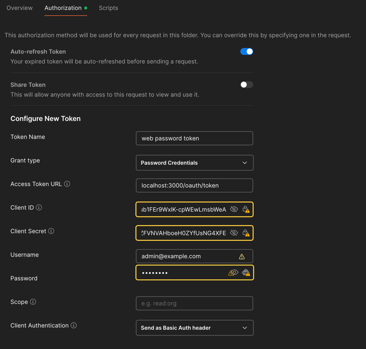

# README

Example of Rails oauth2 provider with grant type password.
This app is built using docker with multistage build.


# SETUP

For local dev, assuming you already have a database installed, just wire up the environment variables.

```.text
DB=
DB_HOST=
POSTGRES_USER=
POSTGRES_PASSWORD=
DB_PORT=
FORCE_SSL=
```

On postman authorization tab, configure the setting as shown below.



# DEPLOYMENT

For deployment or local dev with docker, use this docker compose.
Please note that i also provided `api` as the oauth2 client.

```dockerfile
version: "3.9"

services:
  database:
    healthcheck:
      test: ["CMD-SHELL", "pg_isready -U $${POSTGRES_USER} -d $${POSTGRES_DB}"]
      interval: 5s
      retries: 5
      timeout: 5s
    image: postgres:17.5
    environment:
      POSTGRES_USER: user
      POSTGRES_PASSWORD: password
      POSTGRES_DB: doorkeeper_oauth2
    ports:
      - "5433:5432"     
    volumes:
      - pgdata:/var/lib/postgresql/data
      - ./init-db.sh:/docker-entrypoint-initdb.d/init-db.sh
    networks:
      - oauth

  oauth:
    build:
      context: ./oauth2-rails
      dockerfile: Dockerfile
      args:
        PORT: 3000
        SECRET_KEY_BASE: 4b03804af3458070cebd862f261b0f5620c9283a5da34bdad00986c34f38491374d86f998e4fb4f8f9f0f1d6fcebd0f18559e89121ef6eae2351cefe9d83d3be
    # command: bundle exec puma -C config/puma.rb
    ports:
      - "3000:3000"
    depends_on:
      database:
        condition: service_healthy
    environment:
      DB: doorkeeper_oauth2
      DB_HOST: database
      DB_PORT: 5432
      POSTGRES_USER: user
      POSTGRES_PASSWORD: password
      RAILS_ENV: production
      SECRET_KEY_BASE: 4b03804af3458070cebd862f261b0f5620c9283a5da34bdad00986c34f38491374d86f998e4fb4f8f9f0f1d6fcebd0f18559e89121ef6eae2351cefe9d83d3be
    volumes:
      - ./oauth2-rails:/app
    networks:
      - oauth

  api:
    build:
      context: ./api
      dockerfile: Dockerfile
      args:
        PORT: 3001
        SECRET_KEY_BASE: 4b03804af3458070cebd862f261b0f5620c9283a5da34bdad00986c34f38491374d86f998e4fb4f8f9f0f1d6fcebd0f18559e89121ef6eae2351cefe9d83d3be
    # command: bundle exec puma -C config/puma.rb
    ports:
      - "3001:3000"
    depends_on:
      database:
        condition: service_healthy
    environment:
      DB: api
      DB_HOST: database
      DB_PORT: 5432
      POSTGRES_USER: user
      POSTGRES_PASSWORD: password
      OAUTH_CLIENT_ID: v7DxHRnAbY497dCSJIBZXxY4TWL8kwv2HuH4_JAshY4
      OAUTH_CLIENT_SECRET: hFr3GJ7EsEiNsdckDM_6itxk51EoorJ2_M8OhPsnGzA
      OAUTH_PROVIDER: http://oauth:3000
      RAILS_ENV: production
      SECRET_KEY_BASE: 4b03804af3458070cebd862f261b0f5620c9283a5da34bdad00986c34f38491374d86f998e4fb4f8f9f0f1d6fcebd0f18559e89121ef6eae2351cefe9d83d3be
    volumes:
      - ./api:/app
    networks:
      - oauth

networks:
  oauth:
    driver: bridge

volumes:
  pgdata:

```
Dont forget to change env variables according to your setup.


### Auto Create Database

I added a shell script to auto create multiple database using `./init-db.sh:/docker-entrypoint-initdb.d/init-db.sh`.
You may need to execute `chmod +x init-db.sh` first to properly run it.
```shell
#!/bin/bash
set -e

for db in doorkeeper_oauth2 api; do
    echo "Checking database '$db'"
    exists=$(psql -U "$POSTGRES_USER" -d "$POSTGRES_DB" -tAc "SELECT 1 FROM pg_database WHERE datname='$db'")
    if [[ $exists == "1" ]]; then
        echo "Database '$db' already exists, skipping."
    else
        echo "Creating database '$db'"
        psql -v ON_ERROR_STOP=1 --username "$POSTGRES_USER" --dbname "$POSTGRES_DB" <<-EOSQL
            CREATE DATABASE "$db";
            GRANT ALL PRIVILEGES ON DATABASE "$db" TO "$POSTGRES_USER";
EOSQL
    fi
done

```

# RAILS SETUP

Do the usual setup first like migration and seeding.


Create an application from console
```ruby
Doorkeeper::Application.create!(
  name:         "Client",
  redirect_uri: "https://oauth.pstmn.io/v1/callback", # for development with postman
  scopes:       "public web"
)
```

Setup devise user module as needed in `models/user.rb`
```ruby
class User < ApplicationRecord
    devise :database_authenticatable, :registerable,
           :recoverable, :rememberable, :validatable,
           :confirmable, :lockable, :trackable

    enum role: { user: 0, admin: 1 }

    has_many :oauth_access_grants,
             class_name: 'Doorkeeper::AccessGrant',
             foreign_key: :resource_owner_id,
             dependent: :delete_all

    has_many :oauth_access_tokens,
             class_name: 'Doorkeeper::AccessToken',
             foreign_key: :resource_owner_id,
             dependent: :delete_all
end
```

Init a sample user
```ruby
User.create(email: "user@example.com", password: "password")
```

# TODO
This only covers the basic.
Other features like recoverable, rememberable, validatable, confirmable, lockable, trackable is not yet implemented.